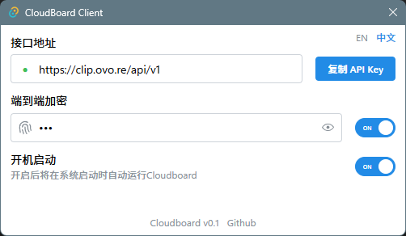

# Cloudboard

开源的 Windows & iOS 剪贴板同步工具，支持端到端加密[^1]

[^1]: 在客户端本地使用 `AES-256-CBC` 算法加密后进行传输，服务端无法获取到原始数据内容

  

  

## 食用方式

1. [前往发布页](https://github.com/journey-ad/cloudboard/releases/latest)，下载并运行 Cloudboard
   - 填写接口地址，并生成 API Key，对应快捷指令的 `api_key` 参数
   - 填写端到端加密密码，对应快捷指令的 `password` 参数

2. 在 iOS 设备上安装 [Scriptable](https://apps.apple.com/cn/app/scriptable/id1405459188)[^2]
   - 下载端到端加解密脚本 [CloudboardEncryptHelper.js](https://raw.githubusercontent.com/journey-ad/cloudboard/master/docs/CloudboardEncryptHelper.js)，并导入到 Scriptable

3. 安装快捷指令
   - 获取剪贴板 https://www.icloud.com/shortcuts/b0ccf3de427c4540bf5a6ea9a631219a
   - 发送剪贴板 https://www.icloud.com/shortcuts/8c2e8b9f06484cc98134b807e73a7767

4. 快捷指令配置 `api_key`、`password` 参数，确保和 Windows 端一致，并检查加解密功能是否已关联到 Scriptable

5. 现在 Windows 端的剪贴板将自动同步至云端，iOS 端使用快捷指令进行同步

[^2]: 这是一个自动化工具，可以在快捷指令中运行 JS 脚本，官网 https://scriptable.app

## 开发说明

这个项目基于 [Tauri](https://tauri.app/) 开发，请参考[前置要求](https://v2.tauri.app/zh-cn/start/prerequisites/)完成 Tauri 开发环境配置

使用 pnpm + React + Mantine UI

### 常用命令

#### `pnpm install`

安装开发依赖

#### `pnpm dev`
> 这是 `pnpm tauri dev` 的别名

启动开发环境，同时运行前端和 Tauri 应用，带有调试工具

#### `pnpm rls`
> 这是 `pnpm tauri build` 的别名

构建前端代码并将其打包成 Tauri 发布版本，用于生成最终的可执行文件

#### `pnpm update`

更新 `package.json` 和 `src-tauri/Cargo.toml` 中的依赖包版本，同时会清理 Rust 的构建文件

### Debug

使用 `cd src-tauri && cargo clean` 清理 Rust 构建文件可以解决一些异常问题
